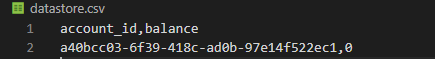

## ℹ️ Background

Here is the solution for the functionality for manipulating balances of multiple accounts.

I have implemented a python code, in which it contains the REST API which is responsible for handling incoming HTTP requests, for that I have divided the modules and implemented the logic. And also implemented unit tests for the code.

As a Data Store I implemented the [datastore.csv](datastore.csv) file where it contains the data which is account id and balance. 

I also implemented a bash script which acts like proxy between the REST API and the data store to handle reading and writing to the data store.

## Data Store Structure

Here the Data Store is a csv file. It has two columns which are account id and balance. Both are separated by comma(","). Account id is in UUID format and balance was int(Integer) as mentioned in [api-specification.yml](api-specification.yml).

To have a clear view please go through the below ScreenShot of the [datastore.csv](datastore.csv).



## The communication flow between the REST API and the bash script.

I have implemented a bash script that acts as a proxy between the REST API and the data store to handle reading and writing.

In bash script we are passing two arguments which will be account id and balance, which will update the balance of that account id in return. 

If account id does'nt exists then it will return -1. If you passs only one argument it will return the balance of the account id.

## To run the soution please follow the below instructions.

Please install following dependencies

[Please install python 3](https://www.python.org/downloads/)
Later install all the requirements in the requirements.txt file by using following command.
```
pip install -r requirements.txt
```
If you find any problem installing the dependencies from requirements.txt try to install them manually.
```
pip install flask
pip install pandas
```
Hope you already have node in your systems orelse [please install node](https://nodejs.org/en/download/)
```
npm install
```
To start the flask server, try following command:
```
python main.py
```
To run unit test try following command in the file directory:
```
python test_basic.py
```
Install Newman & try running the API tests in the file directory: 
```
npm install -g newman
newman run api-tests.json
```


